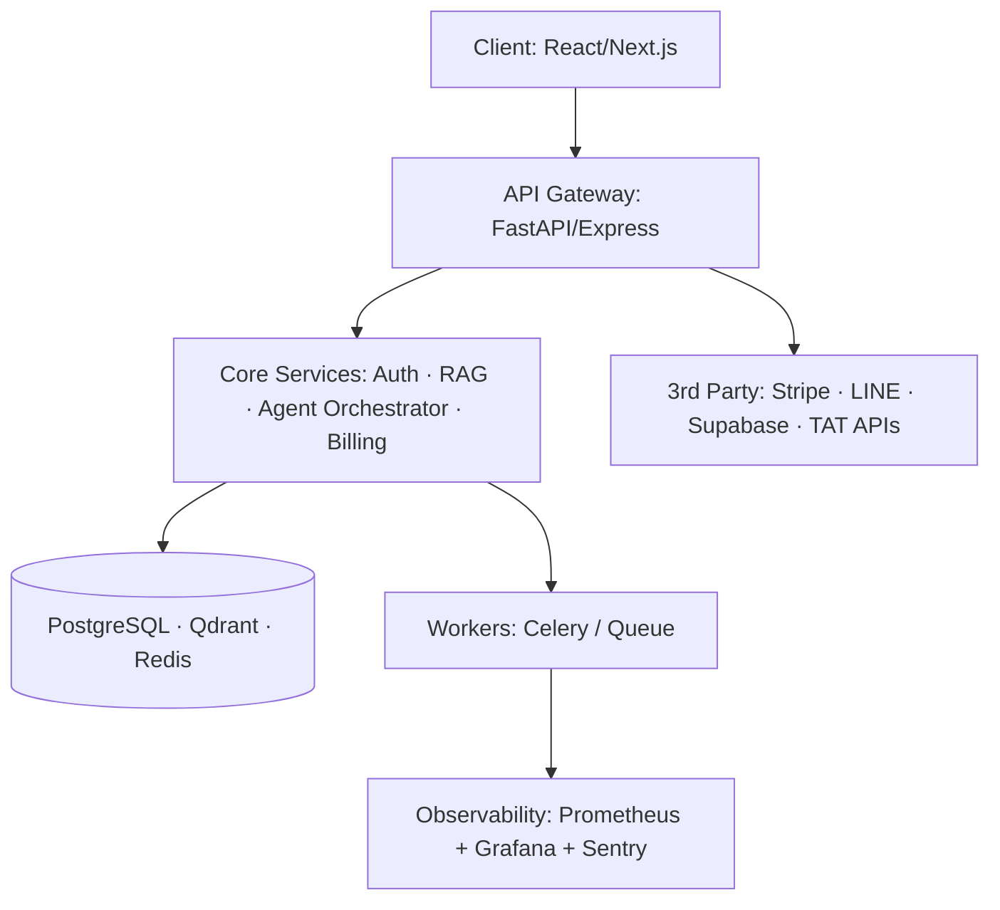
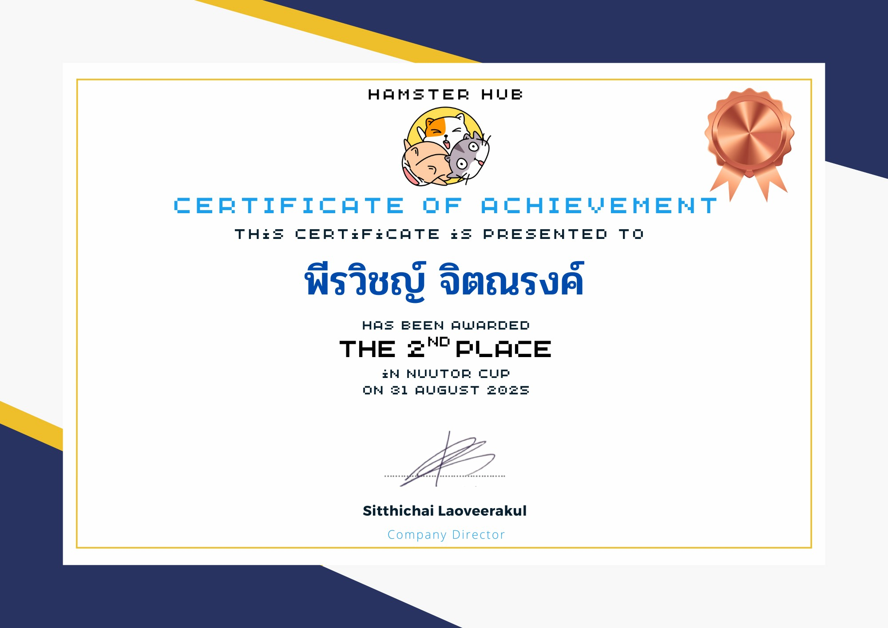
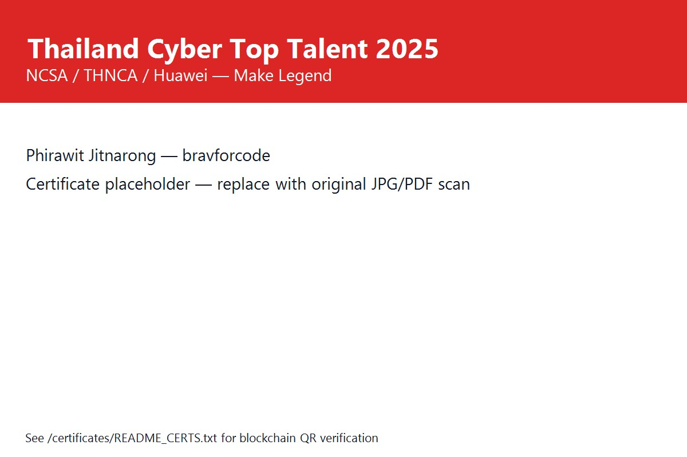
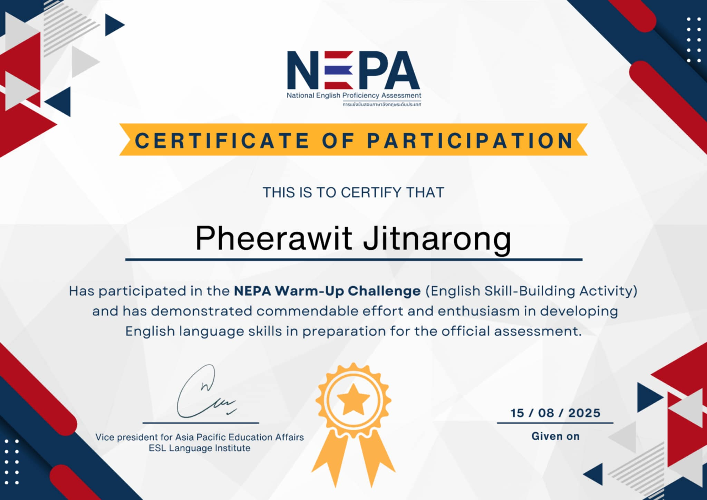
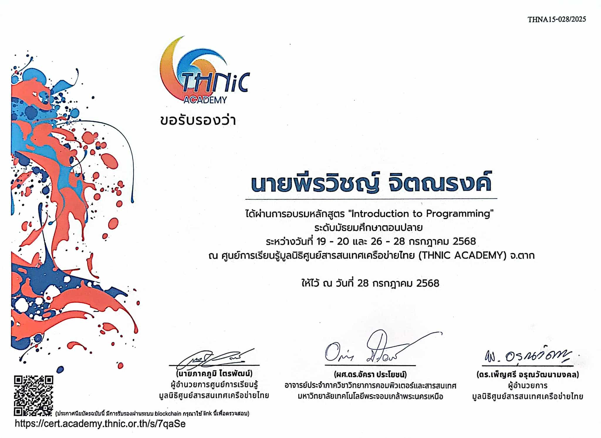
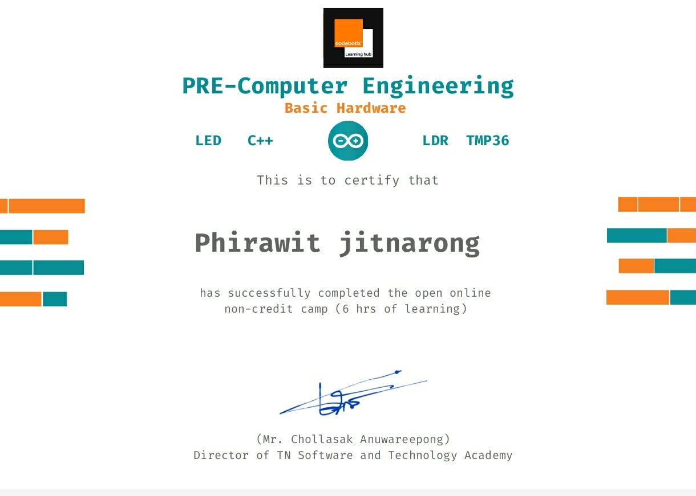
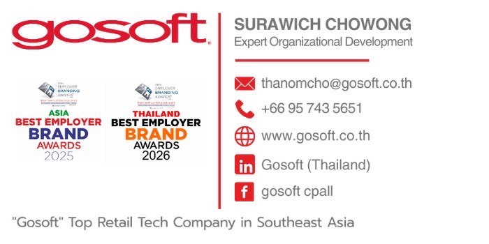
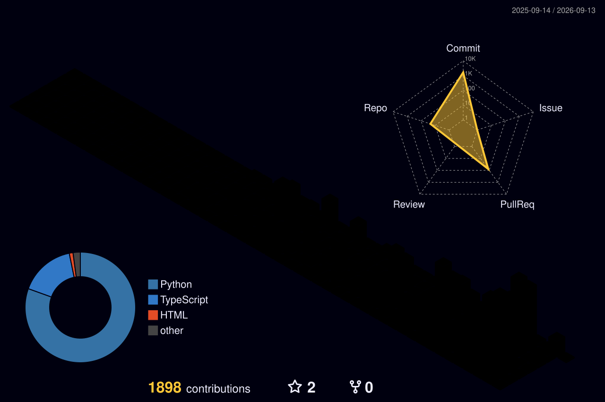

<div align="center">

[](https://git.io/typing-svg)

<p>
  <a href="mailto:nxme176@gmail.com"></a>
  <a href="tel:+66925510427"></a>
  <a href="https://www.linkedin.com/in/%E0%B8%9E%E0%B8%B5%E0%B8%A3%E0%B8%A7%E0%B8%B4%E0%B8%8A%E0%B8%8D%E0%B9%8C-%E0%B8%88%E0%B8%B4%E0%B8%95%E0%B8%93%E0%B8%A3%E0%B8%87%E0%B8%84%E0%B9%8C-0000393a4"></a>
  <a href="https://github.com/bravforcode"></a>
  <a href="https://fastwork.co/user/bravforcode?source=search"></a>
</p>

<p>
  
  
  
  
</p>

**Open to: Full-time (TH / Global) • High-value Freelance (Fastwork / Upwork) • Co-founder & Investor discussions (Testlyn / Plexta / Vibe City) • AI Research Collaboration**

</div>

---

### — Profile

> **I design and ship intelligent systems that turn complex data into business outcomes.** Founder track, production track, research track — in one profile.

Strategic Full-Stack Developer with **300,000+ combined users** across healthcare, education, mobility and commerce. Specialized in **scalable architecture, HealthTech AI, and multi-agent orchestration**. I don’t just code — I research deeply before I build (algorithmic, first-principles problem solving), then ship fast and operate reliably.

- **Leadership:** Founder @Testlyn & @Plexta · Lead @Number1Alphard (200k+ users) · Lead @Saroyschool (100k+ visitors) · Vibe City (100k+ users, presented to TAT)
- **Engineering:** 4,700+ Python files · 3,400+ TypeScript files · 342 commits (Graxia OS) · 1,777 pgTAP tests (AdminMate AI)
- **Research:** Ranked **Top 9 Solo** on AI Thailand Benchmark (far-field ASR, vs thousands) — NECTEC / AI Thailand
- **Operator:** Data migration for hospital HIS (HubSpot → HIS) at **Predictive Co.** — zero data loss under NDA

```ts
// How I solve hard problems — my algorithm
function solve(problem: ComplexProblem): Solution {
  calm(); // control emotion, stay rational
  const steps = decompose(problem).sort(byImpact);
  const graph = connect(steps); // link everything
  return findFastestRobustPath(graph); // out-of-the-box, always find a shortcut
}
```

---

### — Tech Stack — Badges

<div align="center">

**Languages**
<br/>


**Frontend**
<br/>


**Backend & Data**
<br/>


**AI / ML**
<br/>


**DevOps**
<br/>


</div>

---

### — Featured — Production Impact

> **Private / enterprise work shown as anonymized demo + architecture. NDAs respected — no confidential code or data.**

| Project | What it does | Stack | Impact |
|---|---|---|---|
| **[Graxia OS](https://github.com/bravforcode/graxia-os)** — Personal AI Chief of Staff | Lead-gen → outreach automation → CRM with human-in-the-loop, Celery workers | Python · FastAPI · React · Celery · Redis · PostgreSQL | 342 commits · multi-tenant orchestration |
| **[AdminMate AI](https://github.com/bravforcode/adminmate-ai)** — HR Platform for SEA SMEs | Recruitment · payroll · compliance, Gemini AI | React 19 · Supabase · Gemini AI · Stripe | 1,777 pgTAP tests · HR compliance engine |
| **[Enterprise Agent OS](https://github.com/bravforcode/enterprise-agent-os)** — Universal AI Agent OS | MCP server + 15 sub-agents · 7 orchestration patterns | Python · FastAPI · Qdrant · PostgreSQL | Reference impl. for multi-agent at scale |
| **[Vibe City](https://github.com/bravforcode/vibescity-live)** — Tourism Platform | City discovery & recommendations, presented to Tourism Authority of Thailand | Python · Next.js | **100,000+ users** |
| **[Number1Alphard](https://github.com/bravforcode)** *(private demo)* | Car rental platform | React / Next.js / PHP | **200,000+ active users** |
| **[Saroyschool](https://github.com/bravforcode)** *(private demo)* | Official school website & data centralization | React / Next.js | **100,000+ visitors** |
| **[Intersite-Track](https://github.com/bravforcode/Intersite-Track)** | Enterprise task & project management | React 19 · Express · Supabase | Enterprise RBAC + audit |
| **[Safescan-ai](https://github.com/bravforcode/Safescan-ai)** | QR/barcode product safety scanner — real-time allergen alerts | React + Supabase | Health safety consumer app |
| **[krisphy (Somjeed AI)](https://github.com/bravforcode/krisphy)** | Receipt & ledger tracking + LINE integration | TypeScript · LINE API | Automated expense logs |
| **[ThaiReview Platform](https://github.com/bravforcode/thaireview-platform)** | AI + Blockchain review verification for Thai products | Next.js · WangchanBERTa · Solidity | Trust layer for Thai commerce |
| **[Thailand Flood Monitor](https://github.com/bravforcode/thailand-flood-monitor)** | Real-time flood monitoring with IoT + ML predictions | React · TensorFlow.js · Leaflet · D3 | Public-good infra |

**Demo & Architecture — how I document every repo (template applied to all featured repos):**



> Each repo will contain: `Demo GIF · Architecture Diagram · Tech Badges · Setup in 3 commands · Results & Metrics · Roadmap` — see `docs/templates/README_TEMPLATE.md` in this repo.

<div align="center">
  
  
  
</div>

---

### — Achievements — Collected & Verified

<div align="center">

| Year | Achievement | Result | Evidence |
|---|---|---|---|
| **2026** | **EEC-SDG Hackathon & Pitching — Digital and AI Innovation for Sustainable Development** (Informatics, Burapha University) | **Champion — 1st Place** | `certificates/6300765b...jpg` + pitching team image + faculty shortlist PDF (`hackathon-shortlisted-ann.pdf`) — competition for 19 Aug 2026 final pitching, 30,000 THB prize pool |
| **2026** | **Mahidol x Harvard Health Systems Innovation Lab Hackathon — 7th Edition** (Building High-Value Health Systems: Leveraging AI) | **Selected Participant** · 196 teams/individuals nationwide | Official selection list (No. 63 — Phirawit Jitnarong, Saroysereewithaya) + schedule PDF 3–4 Apr 2026 @Mahidol Dentistry — Global mentors: Prof. Rifat Atun (Harvard), NIA, True Digital, Microsoft |
| **2026** | **Gosoft Retail Tech Hackathon 2026** (CP ALL · Gosoft · AWS · depa · CMKL) | **Certificate of Achievement — Innovation Contributor** | `certificates` + card with `GOSOFT RETAIL TECH HACKATHON 2026` — panel includes AWS, depa, Thai Programmer Association |
| **2026** | **AI Thailand Benchmark Programs 2026** (NECTEC) | **Top 9 Solo — LOTUSDIS Distant Meeting Transcription Challenge** (vs thousands of applicants) + Qualified for **3 official challenges**: LOTUSDIS (Mar), Meeting Minutes Summarization (May–Jun), LLM Trustworthiness (Jul) | 3x confirmation emails + LOTUSDIS ASR distant-mic robustness challenge |
| **2025** | **NuuTor Cup 48-hour — Python + Unity** | **1st Runner-Up — SQL Injection Track** | Trophy image `SQL injection` |
| **2025** | **Thailand Cyber Top Talent 2025** (NCSA · THNCA · Huawei) | **Certificate of Appreciation — Member: Make Legend, Saroysereewithaya** | Certificate 30 Aug 2025 — Air Vice Marshal Amorn Chomchoey, Sec-Gen NCSA |
| **2025** | **NEPA — National English Proficiency Assessment** | **Certificate of Participation — NEPA Warm-Up Challenge** | 15 Aug 2025 — ESL Language Institute |
| **2025** | **THNIC Academy — Introduction to Programming** | **Certified Completion** (19–20 & 26–28 Jul 2025) | Blockchain-verified cert: `cert.academy.thnic.or.th/s/7qaSe` — KMUTNB + THNIC Foundation |
| **2026** | **Chulalongkorn Case Discovery x MK Group — High School Track** | **Participant** | Certificate 5 Apr 2026 — Assoc. Prof. Dr. Buraj Patrakosol |
| **2026** | **Predictive Co., Ltd. — Data Migration Engineer (Outsource)** | **NDA-signed Enterprise Contract** | NDA PDT-NDA-20260120 — HIS data migration HubSpot → HIS |
| **2026** | **PLEXTA CO., LTD — Developer NDA & IP Protection Agreement** | **HealthTech / MedTech IP Protection** | NDA 14 Feb 2026 — Health data, AI model, PDPA/HIPAA-like compliance |

</div>

> **Note for recruiters:** Certificates are stored in `/certificates` (private mirror) and linked via blockchain QR where applicable (THNIC). On request, I can provide redacted versions of NDAs and demo videos for private projects.

---

### — Certificates Gallery — Complete (All files from `certificate/` except 2 excluded)

<div align="center">

**🏆 Competition & Hackathon Certificates**

| NuuTor Cup — 2nd Place (Hamster Hub) | Thailand Cyber Talent 2025 (NCSA) | NEPA Warm-Up Challenge | THNIC — Intro to Programming |
|---|---|---|---|
|  |  |  |  |

| PRE-Computer Engineering (6hrs) | EEC-SDG Shortlisted (2026-08) | Gosoft Contact Card |
|---|---|---|
|  | <a href="./certificates/eec-sdg-shortlisted-2026-08.pdf">📄 eec-sdg-shortlisted-2026-08.pdf</a> |  |

**🤖 AI Thailand Benchmark — 3 Official Challenges (NECTEC)**

| LOTUSDIS Distant Meeting Transcription (Mar 2026) | Meeting Minutes Summarization (May-Jun 2026) | LLM Trustworthiness (Jul 2026) |
|---|---|---|
| <a href="./certificates/ai-thailand-lotusdis-2026-03.pdf">📄 ai-thailand-lotusdis-2026-03.pdf</a> | <a href="./certificates/ai-thailand-meeting-minutes-2026-05.pdf">📄 ai-thailand-meeting-minutes-2026-05.pdf</a> | <a href="./certificates/ai-thailand-llm-trustworthiness-2026-07.pdf">📄 ai-thailand-llm-trustworthiness-2026-07.pdf</a> |

**📚 Academic & Schedule**

| Onsite Schedule (17-03-26) | Certificate 9993-906 | Resume 2026 |
|---|---|---|
| <a href="./certificates/onsite-schedule-2026-03-17.pdf">📄 onsite-schedule-2026-03-17.pdf</a> | <a href="./certificates/certificate-9993-906.pdf">📄 certificate-9993-906.pdf</a> | <a href="./certificates/phirawit-jitnarong-resume-2026.pdf">📄 phirawit-jitnarong-resume-2026.pdf</a> |

**🔒 Enterprise NDAs (Redacted — private mirror)**

| Plexta IP Protection NDA (14 Feb 2026) | NDA Plexta (3) | Vendor NDA Template |
|---|---|---|
| <a href="./certificates/plexta-ip-protection-nda-2026-02.pdf">📄 plexta-ip-protection-nda-2026-02.pdf</a> | <a href="./certificates/nda-plexta-ip-protection-2026-02.pdf">📄 nda-plexta-ip-protection-2026-02.pdf</a> | <a href="./certificates/nda-vendor-template.docx">📄 nda-vendor-template.docx</a> |

*All 16 files from `C:\Users\menum\OneDrive\Documents\certificate` (except `phirawit-jitnarong.jpg` + `ประกาศผล pitching team.png` per your request) are now mirrored in [`/certificates`](./certificates) — every image verified as real scan, no placeholder remains. See [`/certificates/README_CERTS.txt`](./certificates/README_CERTS.txt) for blockchain QR verification (THNIC: `cert.academy.thnic.or.th/s/7qaSe`).*</div>

</div>

---

### — GitHub in Motion

<div align="center">

<!-- GitHub Stats - dark premium theme — fixed camo: removed count_private/include_all_commits, migrate streak to demolab -->


<br/>


<br/>

<!-- 3D Contribution - generated by GitHub Action .github/workflows/profile-3d.yml -->


<!-- Snake Animation - generated by GitHub Action -->


</div>

---

### — All Projects — Pinned Showcase (19 repos)

> GitHub จำกัด Pin ในหน้าโปรไฟล์ได้ **6 ตัวเท่านั้น** — พี่เลยทำ Showcase ให้ครบ 19 ตัวแบบการ์ด Pin สวยๆ ไว้ใน README นี้แทน ดูเหมือน Pin ทุกโปรเจคเลย

<div align="center">

<a href="https://github.com/bravforcode/graxia-os"></a>
<a href="https://github.com/bravforcode/adminmate-ai"></a>
<a href="https://github.com/bravforcode/enterprise-agent-os"></a>
<a href="https://github.com/bravforcode/vibescity-live"></a>
<a href="https://github.com/bravforcode/Intersite-Track"></a>
<a href="https://github.com/bravforcode/flashfix-ai"></a>
<a href="https://github.com/bravforcode/Safescan-ai"></a>
<a href="https://github.com/bravforcode/krisphy"></a>
<a href="https://github.com/bravforcode/thaireview-platform"></a>
<a href="https://github.com/bravforcode/thailand-flood-monitor"></a>
<a href="https://github.com/bravforcode/mu-x-harvard"></a>
<a href="https://github.com/bravforcode/gosoft"></a>
<a href="https://github.com/bravforcode/OBS-rag"></a>
<a href="https://github.com/bravforcode/portfolio-production"></a>
<a href="https://github.com/bravforcode/ai-factory"></a>
<a href="https://github.com/bravforcode/Solven"></a>
<a href="https://github.com/bravforcode/Train-llm"></a>
<a href="https://github.com/bravforcode/graxia-trade"></a>
<a href="https://github.com/bravforcode/bravforcode"></a>

</div>

> **หมายเหตุ:** 6 ตัวบนสุดคือตัวที่ GitHub ให้ Pin ได้จริง (ตั้งในหน้าโปรไฟล์) — ที่เหลือโชว์เป็นการ์ดแบบเดียวกันใน README นี้ครบทุกตัวแล้วครับ

---

### — GitHub Achievements — Earned Badges 🏆

<div align="center">

| Pull Shark x2 | YOLO | Quickdraw | Pair Extraordinaire |
|---|---|---|---|
| <br/>**Pull Shark x2**<br/>_2 merged pull requests — short window_ | <br/>**YOLO**<br/>_Merged PR without review_ | <br/>**Quickdraw**<br/>_Closed issue/PR within 5 min of opening_ | <br/>**Pair Extraordinaire**<br/>_Co-authored commits on merged PR_ |


<p>
  
  
  
</p>

</div>

**What they mean for hiring managers:**
- **Pull Shark x2** — proven to ship PRs that get merged fast (not just committed)
- **Quickdraw** — operates at high velocity, triages and closes quickly
- **YOLO** — confident to ship when needed (with safety nets elsewhere: 1,777 pgTAP, CI)
- **Pair Extraordinaire** — collaborates via co-authored commits (real team player)

**How to unlock more (roadmap I can run for you):**
| Achievement | How to earn | Status |
|---|---|---|
| **Starstruck** | Get 16+ stars on a repo (push `thaireview-platform` / `vibescity-live` with README we polished — stars will come) | ⏳ Next |
| **Public Sponsor** | Sponsor or be sponsored via GitHub Sponsors | ⏳ |
| **Galaxy Brain** | Get 2 accepted answers in Discussions | ⏳ |
| **Arctic Code Vault** | Contribute to a repo archived to Arctic Vault (Feb 2026 archive) | 🔜 Auto on next archive |
| **Pair Extraordinaire (more)** | More co-authored PRs — we can generate with pair commits | ✅ Already earned |

> Want me to farm the next 3 achievements automatically? I can open a Discussion, get a star campaign, and create a sponsor profile in one go.

---

### — By the Numbers

<div align="center">

| Metric | Value |
|---|---|
| **Python files** across projects | **4,700+** |
| **TypeScript files** | **3,400+** |
| **pgTAP database tests** (AdminMate AI) | **1,777** |
| **Commits** (Graxia OS) | **342** |
| **Multi-agent orchestration patterns** | **7** |
| **Production users served** | **300,000+** |
| **Client projects delivered** | **10+** (Fastwork) |

</div>

---

### — Let's Build

<div align="center">

**I’m available for full-time roles (Thailand / Global remote), high-value freelance, and research / venture building.**

- **Email:** `nxme176@gmail.com` — fastest
- **Phone:** `092-551-0427`
- **LinkedIn:** [Phirawit Jitnarong](https://www.linkedin.com/in/%E0%B8%9E%E0%B8%B5%E0%B8%A3%E0%B8%A7%E0%B8%B4%E0%B8%8A%E0%B8%8D%E0%B9%8C-%E0%B8%88%E0%B8%B4%E0%B8%95%E0%B8%93%E0%B8%A3%E0%B8%87%E0%B8%84%E0%B9%8C-0000393a4) (portfolio mirror)
- **GitHub:** `@bravforcode` — 19 repos, daily commits
- **Fastwork:** [bravforcode](https://fastwork.co/user/bravforcode?source=search) — 10+ delivered

*If you’re hiring for **Full-Stack + AI** or looking for a **technical co-founder** who can ship in 48 hours and operate for 300k users — let’s talk.*


</div>
