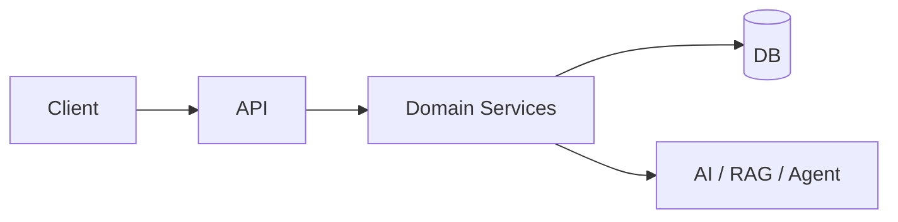

# <Project Name> — One-line value prop in 10 words

<p align="center">
  
  
  
  
</p>

> **Problem → Solution in one sentence.** Who it helps and what outcome.


---

## Why this exists
1-2 paragraphs: The real pain, your insight, why now. Link to users / traction.

## Architecture



## Results (what a hirer cares about)
- **Users:** 10k / 100k / 200k+
- **Performance:** p95 < 200ms, 99.9% uptime
- **Business:** conversion +X%, cost -Y%
- **Tests:** 1,777 pgTAP / 342 commits

## Tech Stack (Badges)
Grouped shields — keep consistent with profile.

## Quickstart (3 commands)

```bash
git clone https://github.com/bravforcode/<repo>
cp .env.example .env
docker compose up --build
```

## Roadmap
- [ ] v1 shipped — what’s next

## Contact
Phirawit Jitnarong — nxme176@gmail.com — 092-551-0427
